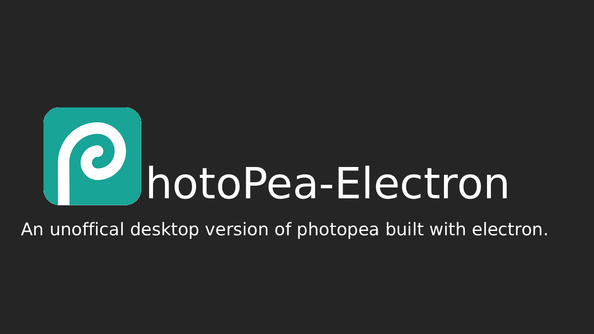
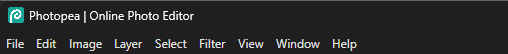
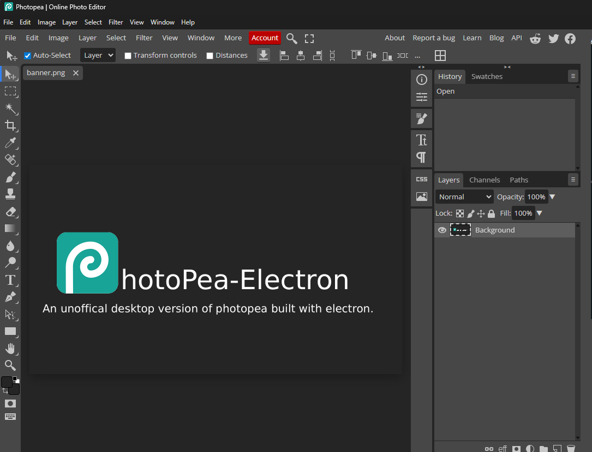

# Photopea Electron

  
*A 1366x768 banner showcasing Photopea Electron*

An unofficial desktop version of [Photopea](https://www.photopea.com) built with **Electron**.  

This project wraps Photopea in an Electron app with:  

- Fast loading times 
- Ribbon menu (similar to Photoshop)  
- Ads removed  

> ⚠️ Note: This is not an official Photopea release. Please respect Photopea's terms of service.

---

## Screenshots

### Splash Screen

  
*Custom splash screen with fast loading bar*

### Ribbon Menu

  
*Interactive ribbon similar to Photoshop*

### Main App Window

  
*Full Photopea interface in an Electron window*

> ⚠️ Replace these placeholders with your actual screenshots.

---

## Download / Install

You can download the latest **portable version / installer** here (link coming soon):  

[Download Photopea Electron](https://github.com/watchmysodium/photopea-electron/releases)  

> Once downloaded:  
> 1. Extract the folder (if portable) or run the installer  
> 2. Double-click `Photopea Electron.exe` to launch  

---

## Getting Started (For Developers)

If you want to run the app from source:

### Requirements

- [Node.js](https://nodejs.org/)  
- [Git](https://git-scm.com/)  

### Install

```bash
git clone https://github.com/watchmysodium/photopea-electron.git
cd photopea-electron
npm install
npm start
